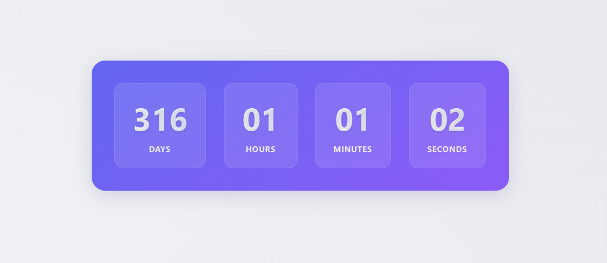

# HQ Countdown Timer Plugin

A lightweight, customizable jQuery countdown timer plugin with multiple instance support.



## Features
- Multiple independent timers
- `data-target-date` attribute support
- Customizable styling
- Ended state class for animations/effects
- Responsive design

## Installation

Include jQuery and the plugin:
```html
<script src="https://code.jquery.com/jquery-3.6.0.min.js"></script>
<script src="hq-countdown-timer.js"></script>
```

## Usage

### Basic Setup
```html
<div class="hq-countdown" data-target-date="2024-12-31T23:59:59">
    <div class="hq-countdown-item">
        <div class="hq-number hq-days">00</div>
        <div class="hq-label">Days</div>
    </div>
    <div class="hq-countdown-item">
        <div class="hq-number hq-hours">00</div>
        <div class="hq-label">Hours</div>
    </div>
    <div class="hq-countdown-item">
        <div class="hq-number hq-minutes">00</div>
        <div class="hq-label">Minutes</div>
    </div>
    <div class="hq-countdown-item">
        <div class="hq-number hq-seconds">00</div>
        <div class="hq-label">Seconds</div>
    </div>
</div>
```

### Initialize
```javascript
$('.hq-countdown').hqCountdownTimer({
  onEnd: function() {
    console.log('Timer finished!');
  }
});
```

## Customization

### Options
| Parameter       | Default               | Description                          |
|-----------------|-----------------------|--------------------------------------|
| `endMessage`    | 'Countdown ended!'    | Message displayed when timer expires|
| `endedClass`    | 'hq-ended'            | Class added to container on finish  |
| `daysSelector`  | '.hq-days'            | CSS selector for days element       |

### CSS Styling
Override these classes in your CSS:
```css
.hq-countdown { /* Container styles */ }
.hq-countdown-item { /* Time unit boxes */ }
.hq-ended { /* Finished state styles */ }
```

## Demo
[View Live Demo](https://hexqode.com/hq-countdown-timer)

## License
MIT